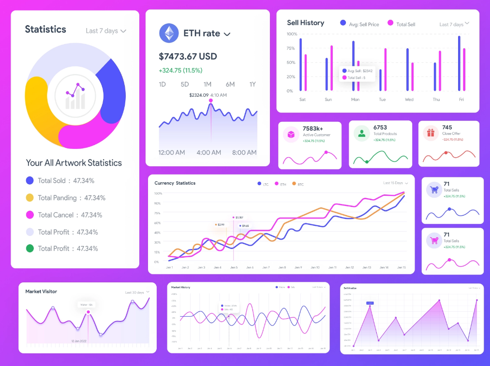

<!-- markdownlint-disable-next-line -->
<p align="center">
  
  
</p>
<h1 align="center">Vis</h1>

<div align="center">

This is a superset of the most commonly used front-end charts based on D3, guiding you to recognize, learn and use the right charts to build your own pages, including PC and Mobile, shop around for experience, and very low-cost style copying , easily build your own theme system, let the datas blingbling!

[](https://github.com/mui-org/material-vis/blob/HEAD/LICENSE)
[](https://www.npmjs.com/package/@mui/material)
[](https://www.npmjs.com/package/@mui/material)
[](https://www.npmjs.com/package/@mui/material)
[](https://codecov.io/gh/mui-org/material-vis/branch/master)
[](https://github.com/mui-org/material-vis/issues/27062)
[](https://isitmaintained.com/project/mui-org/material-vis 'Average time to resolve an issue')
[](https://translate.mui.com/project/material-vis-docs)
[](https://opencollective.com/mui)

</div>

## Installation

Vis is unavailable as an [npm package](https://www.npmjs.com/package/).

**[Stable channel v0.1](https:///)**

```sh
// with npm
npm install vis @emotion/react

// with yarn
yarn add vis @emotion/react
```

## Major features

- D3 solutions
- **Out-of-the-box** common mobile development functions
- ES6 and CommonJS modules
- Tree shaking of ES6 modules
- Almost the **best API** to use on the market
- **Zero-cost** style overrides and theme configuration
- Sophisticated and elegant style design
- An [API](https:///) for JavaScript and Typescript

## Usage

Here is a quick example to get you started, **it's all you need**:

```jsx
import React from 'react'
import ReactDOM from 'react-dom'
import LineChart from 'vis'

function App() {
  useEffect(() => {
    LineChart
  })
  return <div id="chart" />
}

ReactDOM.render(<App />, document.querySelector('#app'))
```

Yes, it's really all you need to get started as you can see in this live and interactive demo:

## License

This project is licensed under the terms of the
[MIT license](/LICENSE).

## So

Check out the [getting started](https:///) instructions if you want to give your vis a newborn.
